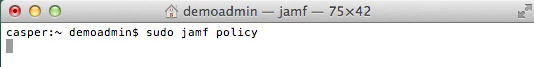
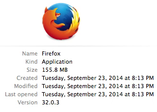
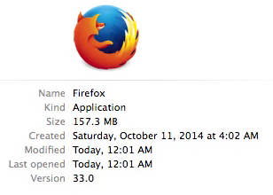

# Auto Update Magic

&nbsp;


_[Auto Update Magic: Keeping Mac apps up to date automatically with Casper and AutoPkgr](http://www.jamfsoftware.com/news/auto-update-magic-keep-mac-apps-current-with-the-casper-suite-and-autopkgr/)_<br />_Presented by Elliot Jordan, Senior Consultant, [Linde Group](http://www.lindegroup.com)_<br />_JAMF Nation User Conference - October 22, 2014 - Minneapolis, MN_

---

## Table of Contents

- [Overview](#overview)
- [Status quo](#status-quo)
- [New tools to the rescue](#new-tools-to-the-rescue)
    - [AutoPkg](#autopkg)
    - [JSSImporter](#jssimporter)
    - [AutoPkgr](#autopkgr)
- [The Magic](#the-magic)
    - [Level 1: Self Service](#level-1-self-service)
    - [Level 2: Auto to Some](#level-2-auto-to-some)
    - [Level 3: Auto to All](#level-3-auto-to-all)
    - [Bonus: Creating both Self Service and Auto Update policies](#bonus-creating-both-self-service-and-auto-update-policies)
- [Notes and caveats](#notes-and-caveats)
- [Acknowledgements](#acknowledgements)
- [Files included in this repo](#files-included-in-this-repo)

---


## Overview

Mac app patch management in Casper is not trivial, and yet it's one of the most important functions of any device management framework. Outdated apps can expose security vulnerabilities, cause file format incompatibilities, and prevent people from taking advantage of the latest and greatest app features.

In this article, I'll take you thorugh a new method to keep your Mac apps updated with your Casper JSS. Following the directions below, you can start automating your Mac app patching _today_.


## Status quo

First, let me share with you the way I used to keep apps updated in Casper. This isn't necessarily a "best practice," but simply one method that worked well for me.

- The IT team downloads the installer package (or creates it with Composer), and puts it into Casper.
- A **smart group** is created to select computers with an out of date version of this app.
- A recurring **"trigger" policy** is scoped to the smart group, and triggers a script.
- The **script** checks to see whether the app to be updated is currently open.
- If the app is not currently open, the script triggers an **"installer" policy** which installs the update and runs recon.

This process works fine, but it has several pain points.

- Composing a new package of each software version is tedious and error-prone.
- The smart group criteria must be manually updated with each version.
- Waiting too long to update Casper may result in newer versions of apps being overwritten with older versions — not good at all.
- Trigger policies basically double the number of policies you must maintain.
- The installer must be updated manually with each new version of the software, which can be tedious in itself.

The benefit of a workflow like this is you maintain total control over your available software updates, but it's tedious, prone to errors, and requires babysitting. There's got to be a better way, right?


## New tools to the rescue

Fortunately, several tools have emerged in the last year that have significantly improved this workflow.

### [AutoPkg](https://github.com/autopkg/autopkg)

AutoPkg is a relatively new command-line tool from [Greg Neagle](https://github.com/gregneagle), [Tim Sutton](https://github.com/timsutton), and [Per Olofsson](https://github.com/MagerValp), that automatically packages OS X software for easy distribution. It uses community-contributed "recipes" to produce a neat and tidy .pkg file that can be used with many deployment systems, including Casper.

### [JSSImporter](https://github.com/sheagcraig/JSSImporter)

Conceived by [Allister Banks](https://github.com/arubdesu) and rewritten by [Shea Craig](https://github.com/sheagcraig/), JSSImporter serves as the direct link between AutoPkg and your JSS. Combined with a `.jss` recipe, JSSImporter allows automatic creation of the smart groups, policies, and packages necessary to distribute apps in Casper.

### [AutoPkgr](https://github.com/lindegroup/autopkgr)

AutoPkgr is a Mac app that puts a friendly face on AutoPkg and makes it super easy to get started using it. It was created by [James Barclay](https://github.com/futureimperfect), [Josh Senick](https://github.com/jsenick), and Elliot Jordan (that's me) at the [Linde Group](http://www.lindegroup.com/), with significant help from [Eldon Ahrold](https://github.com/eahrold).

The goal of AutoPkgr is to make it simple and straightforward to start using AutoPkg, and to that end, we're happy to announce that **AutoPkgr now supports basic AutoPkg-to-JSS integration out of the box**.


Here's how to use it:

1. Open AutoPkgr, and use the **Install** tab to install Git and AutoPkg if you haven't already.
1. Click on the **Folders & Integration** tab.
1. Enter your JSS URL and API account credentials. Click **Connect**.
1. Install JSSImporter when prompted.
1. Enter the read/write password for each distribution point when prompted.
1. Switch back to the **Repos & Recipes** tab. Filter for recipes that end in `.jss`, and add the ones you need.
1. On the **Schedule** tab, click **Check Apps Now**. The apps you selected will be imported automatically to your JSS!


## The Magic

Here's the magic you've been waiting to see. Fully automatic updates using Casper.

[](https://www.youtube.com/watch?v=ZUD8C8Tr3XI)

#### On the JSS

1. AutoPkgr triggers AutoPkg to run regularly (perhaps every 4 hours).
1. When new versions of apps are detected, they are _automatically_ imported into the JSS, assigned to a policy, and scoped to a smart group.

#### On the managed Mac

1. The JAMF agent runs a recurring check-in. (This normally happens _automatically_ every 15 or 30 minutes; we have used Terminal here to call it manually with the same effect.)

    

2. Firefox is not up to date. A single **Auto Update Magic** policy runs a script on each managed Mac that determines whether the apps are running.

    

3. If not, the script calls the policy that updates them automatically.

    

4. Firefox is now up to date.

    


That's the end goal: completely automated patch management, from end to end. But let's back up and put the pieces together.

There are three possible levels of automation that you can use AutoPkgr to enact. Here's a detailed look at each level.


### Level 1: Self Service

This workflow, which is the default for JSSImporter, is a very safe and conservative way to begin testing app packages in your Casper environment. It imports app updates into Casper and makes them available to the Testing group via Self Service. Our new version of AutoPkgr makes this super easy to configure.

Here's how to set it up, assuming you already have a working JSS:

1. Create a static computer group on your JSS called **Testing**. Add one or more test computers to the group.
1. Create an account on your JSS with Create, Read, and Update access to the following objects:
    - Categories
    - Smart Computer Groups
    - Static Computer Groups
    - Computer Extension Attributes
    - Packages
    - Policies
    - Scripts
    - File Share Distribution Points (only needs Read access)
1. Install version 1.1 or higher of [AutoPkgr](https://github.com/lindegroup/autopkgr/releases/latest).
1. Open AutoPkgr and click the buttons to install Git and AutoPkg, if you haven't already.
1. In AutoPkgr, click on the **Folders & Integration** tab.
1. In the **Casper Suite integration** section, enter your JSS URL, API username, and API password. Then click **Connect**.
1. When prompted, follow the instructions to install JSSImporter.
1. When prompted, enter the read/write password for each distribution point.

You'll also want to make sure you have a few `.jss` recipes selected. AutoPkgr will automatically add the [sheagcraig/jss-recipes](https://github.com/sheagcraig/jss-recipes) repo so you'll have a few to choose from. If the `.jss` recipes you choose have any parent recipes, be sure to add their repos too. (For example, `Firefox.jss` requires adding the [autopkg/recipes](https://github.com/autopkg/recipes) repo.)

When a `.jss` recipe runs, the package is uploaded to your distribution points, a Self Service policy is created and scoped to a new smart group. As a result, computers in the Testing group with less than the latest version of the app should now be able to install the latest version through Self Service.


### Level 2: Auto to Some

This workflow is more automatic than the Self Service policy above, but still allows for deliberate testing prior to mass deployment. The script, recipe, and template customizations require an administrator who is comfortable with editing XML files and shell scripts.

Here's how to set it up with `Firefox.jss`, assuming you've already done the Level 1 steps above:

1. Create a new category called **Auto Update** (in **Settings > Global Management > Categories**).
2. Upload my `auto_update_magic.sh` script (included in this repo) to your JSS.
    1. Assign it to the **Auto Update** category.
    1. In the **Options** tab, set parameter 4 to **Hours between auto updates**.
    1. Click **Save**.
3. Create a policy called **Auto Update Magic**:
    1. Assign it to the **Auto Update** category.
    1. Have it trigger on **Recurring Check-in**, and also on **Startup**.
    1. Set the **Execution Frequency** to **Ongoing** (or less frequently if you like).
    1. Add the `auto_update_magic.sh` script into the policy. (Doesn't matter whether you choose Before or After.)
    1. Set the parameter value for **Hours between auto updates** to your preferred number. (I recommend an integer between 1 and 8, inclusive.)
    1. Set the **Scope** to the **Testing** static computer group.
    1. Click **Save**.
4. In AutoPkgr, locate the `Firefox.jss` recipe, and right-click on it. Choose **Create Override**. Right-click again and choose **Open Recipe Override** to open the file in a text editor.
5. In the `Input` dictionary, remove all but this key:
```
        <key>POLICY_CATEGORY</key>
        <string>Auto Update</string>
```
6. Copy the `Firefox.png`, `PolicyTemplate.xml`, and `SmartGroupTemplate.xml` files from `~/Library/AutoPkg/RecipeRepos/com.github.sheagcraig.jss-recipes/` to `~/Library/AutoPkg/RecipeOverrides/`.
7. Edit the `PolicyTemplate.xml` file with a text editor.
    1. Remove the contents of the `self_service` section.
    2. In the `general` section, change the name of the policy:
    `<name>Auto Update %PROD_NAME%</name>`
    3. Also in the `general` section, create the custom trigger:
    `<trigger_other>autoupdate-%PROD_NAME%</trigger_other>`
8. Return to the `auto_update_magic.sh` script on your JSS and add new lines as appropriate to the RECIPE_NAME and BLOCKING_APPLICATION sections, using the examples to guide you. For example:
```
RECIPE_NAME=(
    "Firefox"
)
BLOCKING_APPS=(
    "Firefox"
)
```
If no blocking apps are required (for example, if you want to go ahead and update Flash regardless of which browsers are running), then speficy a fake blocking app name.
```
RECIPE_NAME=(
    "Firefox"
    "AdobeFlashPlayer"
)
BLOCKING_APPS=(
    "Firefox"
    "NoBlockingAppForAdobeFlashPlayer"
)
```
9. Open AutoPkgr and click **Check Apps Now**, or run `autopkg run Firefox.jss` in Terminal.
10. Verify that your policy and smart group were created successfully.


### Level 3: Auto to All

This is the "magic" workflow demonstrated in the screencast above. It is by far the most automatic way to update apps using Casper, but should be implemented with great care. The apps are updated quickly and without testing, so it's likely that this will cause something to break someday. Only do this for non-mission-critical apps, and only after you've tested using Level 2 above.

1. Navigate to `~/Library/AutoPkg/RecipeOverrides` and edit the `SmartGroupTemplate.xml` file.
2. Remove these lines from the file:
```
        <criterion>
            <name>Computer Group</name>
            <priority>2</priority>
            <and_or>and</and_or>
            <search_type>member of</search_type>
            <value>Testing</value>
        </criterion>
```
3. Set the scope of the Auto Update Magic policy to **All Managed Clients**.

This will install automatic updates for all Macs, rather than just the ones in the Testing group.

For each recipe you add, be sure to:

1. Make and edit a recipe override.
2. Add the app's name to the `auto_update_magic.sh` script on your JSS.
3. (Optionally) Copy the icon file (in PNG format) to the RecipeOverrides folder. (This is only needed if you plan to use Self Service policies.)

If you add a recipe like `AdobeFlashPlayer.jss`, `OracleJava7.jss`, or `Silverlight.jss`, be sure to also add the supporting files such as `_____SmartGroupTemplate.xml` and `_____ExtensionAttribute.xml`.


### Bonus: Creating both Self Service and Auto Update policies

Chances are, you've got Self Service policies that you want to keep up to date, even if a separate policy automatically updates the already-installed apps. Better to deploy apps that are already up to date, right?

Here's how to run the Level 2/3 Auto Update recipes side-by-side with recipes that keep Self Service up to date.

1. In your RecipeOverrides folder, duplicate the `PolicyTemplate.xml` file. Name the copy `PolicyTemplate-SelfService.xml`.
2. Also duplicate the auto-update recipe override for the app you'd like to update in Self Service. Name the copy (for example) `Firefox-SelfService.jss.recipe`.
3. Edit the `PolicyTemplate-SelfService.xml` file:
    1. Change the `<name>` of the recipe to `%PROD_NAME%`.
    2. Change the `<trigger_other>` of the recipe to  `selfservice-%PROD_NAME%`.
    3. In the `<scope>` section, add `<all_computers>true</all_computers>`.
    4. Expand the `<self_service>` section as follows:
    ```
        <self_service>
            <use_for_self_service>true</use_for_self_service>
            <install_button_text>Install %VERSION%</install_button_text>
            <self_service_description>%SELF_SERVICE_DESCRIPTION%</self_service_description>
        </self_service>
    ```
4. Edit the `Firefox-SelfService.jss.recipe` file:
    1. Make sure the `Identifier` key is unique. For example: `com.github.homebysix.jss.Firefox-SelfService`
    2. Set the `POLICY_CATEGORY` to the desired category. For example: `Web Browsers and Internet Utilities`
    3. Set the `POLICY_TEMPLATE` to the new template file you created: `%RECIPE_DIR%/PolicyTemplate-SelfService.xml`
    4. Remove the `GROUP_NAME` and `GROUP_TEMPLATE` keys.
    5. Also remove the `groups` array forom the `Arguments` section.
5. Open AutoPkgr and check the box for the new -SelfService recipe you created.

It may be useful to refer to the example `Firefox-SelfService.jss.recipe` and `PolicyTemplate-SelfService.xml` files provided in this repo.


## Notes and caveats

### Use at your own risk

This method is on the bleeding edge, and you can bet that there are a few bugs that need squashing. In addition, you may find that not everything works as described in your specific environment. Test thoroughly on a sample Mac before deploying to everybody in your company.

If you open an [issue](https://github.com/homebysix/auto-update-magic/issues) on this GitHub repo, I'll do my best to help you troubleshoot. But I take no responsibility for any harm caused by over-automation.


### Run AutoPkgr on a Mac with access to all DPs

It's a good idea to run AutoPkgr from a Mac that has network access to all distribution points. If no such Mac exists, you can omit non-accessible DPs by clicking Cancel when AutoPkgr prompts you for a specific DP's password. That DP will be skipped (which means you'll need to use Casper Admin to replicate it manually, or set up a system like rsync to replicate it automatically).


### JSSRecipeCreator

Shea Craig has written a great tool called [JSSRecipeCreator](https://github.com/sheagcraig/JSSRecipeCreator) that makes it much simpler to create `.jss` recipes. Highly recommended.


### Don't forget to bring your parents

When you add a `.jss` recipe, be sure that you also add the AutoPkg repository of its parent recipe, if a parent recipe exists. AutoPkgr doesn't do this automatically.


### Open source pros and cons

Because AutoPkg, JSSImporter, and AutoPkgr all are open source, JAMF is not responsible for their upkeep or support. If you have questions, your JAMF rep will likely not be able to help.

Fortunately, the developers of all the projects above have so far been very responsive to questions and advice-seekers.


### Automatically deploying plugins like Flash and Java

For software like Adobe Flash Player that doesn't have an associated "app," you may want to create a separate FlashPolicyTemplate.xml file that uses `<trigger_checkin>true</trigger_checkin>` instead of `<trigger_other>autoupdate-%PROD_NAME%</trigger_other>`. See the files in this repo for an example of the Flash recipe override and policy template I use. (Note: This will not check whether web browsers are running, so update at your own risk.)


### Always-on apps like Dropbox

The methods above don't yet work for always-running apps like Dropbox, because it's impossible for Casper to launch apps with the current user's context. A LaunchAgent-based solution may be in the works, and we'd welcome your contribution if you'd like to help craft it.


### A few troubleshooting tips

- Be sure Casper Admin and AutoPkgr are not running at the same time. Otherwise one or the other may fail to mount the distribution points.


## Acknowledgements

Auto Update Magic stands on the shoulders of giants. Specifically, I'd like to thank [Eldon Ahrold](https://github.com/eahrold) and [James Barclay](https://github.com/futureimperfect) for their work on adding the new JSS integration features to AutoPkgr.

And of course we couldn't have done that without significant help from [Shea Craig](https://github.com/sheagcraig), who built upon [Allister Banks](https://github.com/arubdesu/)'s original jss-autopkg-addon.

And none of the above would have happened at all if not for AutoPkg, the amazing, stable, and infinitely useful packaging tool by [Greg Neagle](https://github.com/gregneagle), [Tim Sutton](https://github.com/timsutton), and [Per Olofsson](https://github.com/MagerValp). The Mac admin community owes them a huge thanks.


## Files included in this repo:

In this repository, I've included copies of the files mentioned above. These should serve as useful starting points, but feel free to tweak and customize them for your own particular environment. And remember you can see the original unmodified files anytime at `~/Library/AutoPkg/RecipeRepos/com.github.sheagcraig.jss-recipes`, for comparison.


### Scripts

- **auto_update_magic.sh** policy script

This is the script used by the "trigger" policy in order to determine whether apps that need updating are currently running. If the apps aren't running, the script calls the appropriate custom policy trigger for the app updater.


### RecipeOverrides

- **Firefox.jss** recipe override

This recipe determines what happens when autopkg runs the Firefox.jss recipe. It's a good one to use as a template for other apps.

Note that there is a ParentRecipe specified, so you should subscribe to the `github.com/autopkg/recipes` repo.

- **Firefox-SelfService.jss** recipe override

This recipe allows you to run a Firefox auto update policy side-by-side with another Firefox policy for Self Service.

- **PolicyTemplate.xml** policy template

This determines the parameters of the policy updated when a standard `.jss` recipe runs. You will modify this file if you need to change the trigger used, or add Self Service information to the policy, for example.

- **PolicyTemplate-SelfService.xml** policy template

This determines the parameters of the policy updated when a `_____-SelfService.jss` recipe runs.

- **SmartGroupTemplate.xml** smart group template

This determines the criteria of the smart group updated when the `.jss` recipe runs. You will modify this file if you need to scope a policy all managed Macs, rather than just to the "Testing" static computer group.

- **AdobeFlashPlayer.jss.recipe** recipe override

This is an example recipe for Adobe Flash Player. This example updates Flash without quitting any browsers, which is only appropriate if the users in your environment unanimously use Google Chrome.

- **AdobeFlashPlayerPolicyTemplate.xml** policy template

This is an example policy template for Adobe Flash Player. (This template does not close browsers before updating Flash. I'll provide a policy template and script that does that in a future update.)


## Comments and suggestions

I'd love to hear your feedback! If you find a problem, feel free to open an [issue](https://github.com/lindegroup/autopkgr/issues) on our AutoPkgr Git repo, and we'll do our best to help troubleshoot. Or if you'd like to ask a general question or give some praise, feel free to join us on our [Google Group](https://groups.google.com/forum/#!aboutgroup/autopkgr-discuss) or in the [JAMFNation forums](https://jamfnation.jamfsoftware.com/discussion.html?id=12280).

[Watch the original presentation on the JAMF website](http://www.jamfsoftware.com/resources/auto-update-magic-keep-mac-apps-current-with-the-casper-suite-and-autopkgr/).
