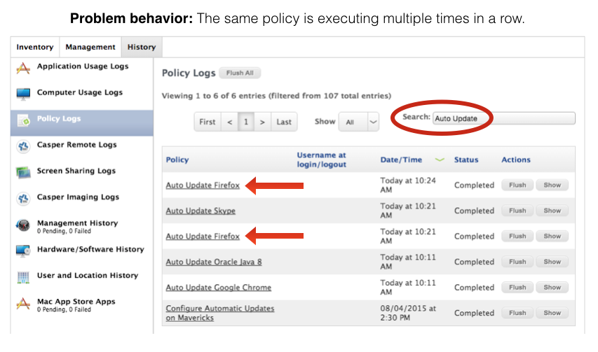

# Auto Update Magic


## Table of Contents

<!-- #MarkdownTOC autolink=true depth=4 bracket=round -->

- [Overview](#overview)
- [Requirements](#requirements)
- [Exercises](#exercises)
- [Setup](#setup)
  - [Script configuration](#script-configuration)
  - [Installer creation](#installer-creation)
  - [Jamf Pro server setup](#jamf-pro-server-setup)
  - [AutoPkgr setup](#autopkgr-setup)
      - [Add AutoPkg templates](#add-autopkg-templates)
      - [Configure AutoPkgr](#configure-autopkgr)
      - [Create recipe overrides](#create-recipe-overrides)
      - [Run recipe overrides](#run-recipe-overrides)
  - [Testing](#testing)
- [Operational workflow](#operational-workflow)
- [Rollback plan](#rollback-plan)
- [Troubleshooting](#troubleshooting)
    - [Remove one layer and try again](#remove-one-layer-and-try-again)
    - [Check for bad recipe overrides](#check-for-bad-recipe-overrides)
    - [Check for missing parent recipes](#check-for-missing-parent-recipes)
    - [Test the LaunchDaemon and script pair](#test-the-launchdaemon-and-script-pair)
    - [Find and fix loopers](#find-and-fix-loopers)
    - [Check for policy failures](#check-for-policy-failures)
- [Getting help](#getting-help)
    - [Community support](#community-support)
    - [Consulting services](#consulting-services)
    - [Found a problem?](#found-a-problem)

<!-- /#MarkdownTOC -->


## Overview

Keeping Mac apps up to date with Jamf Pro is anything but trivial, and yet it's one of the most critical tasks of any management system. Outdated apps can expose security vulnerabilities, cause file format incompatibilities, and prevent people from taking advantage of the latest and greatest app features.

Auto Update Magic is my attempt to make updating apps easier for Jamf Pro administrators. I have provided instructions, example workflows, scripts, recipes, and a LaunchDaemon that will help you keep your Mac apps updated with your Jamf Pro server.

Yes, Jamf Pro has introduced Patch Management since this script was written. However, Auto Update Magic integrates nicely with an existing AutoPkgr configuration, and gives you total control over how apps are packaged, imported, and deployed.


## Requirements

Here's what you'll need in order to use this framework:

- Admin access to your Jamf Pro server, including the ability to create user accounts.
- A Mac that is always on and is running OS X 10.9 or higher, for compatibility with AutoPkgr.

    - If the above Mac is not also suitable for testing new software releases (e.g. if it's a distribution point), then you'll also need another Mac for testing.

- At least one full workday. Allow at least 4 hours to step through the example [exercises](/exercises/) with Firefox, and another 2-4 hours to add additional apps and customized workflows. Add another 2-4 hours to write decent documentation once you've got things working.


## Exercises

See [Exercises](/exercises/) for a walkthrough detailing how to configure Jamf Pro and AutoPkgr with the Auto Update Magic framework, using Firefox as an example deployment.


## Setup

### Script configuration

Open the script file (__payload/Library/Scripts/auto_update_magic.sh__) with a text editor (e.g. Atom) and customize the following variables to your organization's needs:

- `TRIGGERS`

    Add a line for each auto update custom trigger. This is almost always the same as the recipe's name. Trigger and recipe names may contain spaces.

- `BLOCKING_APPS`

    For each recipe listed under `$TRIGGERS`, add a corresponding line for each "blocking application" (apps/processes that must not be open if the app is to be updated automatically). You can add multiple comma-separated applications per line. Use `pgrep -ix $processName` (substituting the actual process name for `$processName`) to test whether the blocking behaves as expected.

- `DEBUG_MODE`

    Set `$DEBUG_MODE` to true if you wish to do a "dry run." This means the custom triggers that cause the apps to actually update will be logged, but NOT actually executed. Set to false prior to deployment.

### Installer creation

Download and install [munkipkg](https://github.com/munki/munki-pkg), if you haven't already. Add the `munkipkg` binary location to your `PATH` or create an alias in your shell profile so that you can reference the command directly.

Each time you make changes to the script, we recommend changing the following three things:

- The Last Modified metadata in the script.
- The Version metadata in the script.
- The `version` key in the build-info.plist file (recommend matching the script version).

With munkipkg installed, run this command to generate a new installer package in the build folder:
    ```
    munkipkg /path/to/auto_update_magic
    ```

The subsequent installer package can be uploaded to Jamf Pro and scoped as specified below in the Jamf Pro server setup section.

### Jamf Pro server setup

1. Upload this package (created with munkipkg above) to the Jamf Pro server via Jamf Admin or via the web app.

2. Create an account with __Create__, __Read__, and __Update__ access to the following objects:

    - Categories
    - Computer Extension Attributes
    - File Share Distribution Points (only needs Read access)
    - Packages
    - Policies
    - Scripts
    - Smart Computer Groups
    - Static Computer Groups

3. Create the following policy:

    - __Auto Update Magic__
        - Triggers:
            - __Recurring Check-in__
            - Custom: __auto-update-magic__
        - Execution Frequency: __Once per computer__
        - Packages:
            - __auto_update_magic-x.x.x.pkg__
        - Scope:
            - When testing your deployment, limit scope to a handful of Macs you can test on (a static or smart computer group would ease this process). Once you're ready to enable automatic updates in production, expand scope to __All Computers__.

### AutoPkgr setup

#### Add AutoPkg templates

Copy the provided AutoPkg recipe and smart group templates from the [autopkg-templates](autopkg-templates/) folder of this repo into your `~/Library/AutoPkg/RecipeOverrides` folder.

#### Configure AutoPkgr

1. Download the [latest release of AutoPkgr](https://github.com/lindegroup/autopkgr/releases/latest).

2. Copy the app to your __Applications__ folder, then launch it from there.

3. If AutoPkg is not already installed, click the __Install AutoPkg__ button and enter your password when prompted.

4. If Git is not already installed, click the __Install Git__ button and enter your password when prompted.

5. On the __Repos & Recipes__ tab, check the box to add the topmost repository, `https://github.com/autopkg/recipes.git`.

6. Switch to the __Schedule__ tab, and configure the schedule to run as desired. Check the __Enable scheduled AutoPkg runs__ box.

    

7. Switch to the __Notifications__ tab, and configure the notifications as desired.

    

8. Switch to the __Folders & Integration__ tab, then click __Install JSSImporter__. Enter your admin password when prompted.

    ⚠️ Note: On Macs with a fresh copy of Sierra, you may additionally need to run the following Terminal command to install the necessary components for JSSImporter:
    ```
    sudo easy_install pip && pip install -I --user pyopenssl
    ```

9. Click the button that now says __Configure JSSImporter__.

10. Enter the Jamf Pro URL, API username, and API password for the Jamf Pro server account you created previously, then click __Connect__.

    

11. If you use file share distribution points, you'll be prompted to enter their passwords. If you use a cloud distribution point or JDS as your master, check the __Use Master JDS__ checkbox. Click __Save and Close__.

#### Create recipe overrides

1. In __AutoPkgr__, under the __Repos & Recipes__ tab, locate a JSS recipe you want to start packaging for automated patching.

2. Right-click on the JSS recipe and choose __Create Override__. Name the override __`$applicationName`-testing.jss__ (replace `$applicationName` with the application name used for the parent JSS recipe). This override will be run manually in Self Service for initial deployment testing.

3. Create a second override and name it __`$applicationName`-autoupdate.jss__. This override will be used in production for automated patching (once the __-testing__ recipe has been confirmed as working correctly).

4. The new recipes should appear in AutoPkgr's recipe list. Right-click on __`$applicationName`-testing.jss__ and choose __Set Recipe Editor__. Select your preferred text editor. If you don't have a preference, I suggest [Atom](https://atom.io) to get you started (don't use TextEdit, Pages, or Word).

5. Right-click on __`$applicationName`-testing.jss__ again, and choose __Open Recipe Override__.

    Does this look familiar? If you've seen Apple preference files before, you'll recognize this as a plist (property list) file.

6. Make any desired changes in the recipe override. A recipe "override" allows you to override specific keys in pre-fabricated recipes. Overrides also allow you to name your recipes in a consistent manner, as with the __-testing__ suffix we're using here. This makes it easier to find in the AutoPkgr recipe list later.

7. Save, then quit your text editor.

8. Repeat the above edits with the __-autoupdate__ recipe override.

#### Run recipe overrides

1. Open Terminal and run your recipe overrides:
    ```
    autopkg run -v $applicationName-testing.jss
    autopkg run -v $applicationName-autoupdate.jss
    ```

2. After a moment, you should see the summary of changes made to your Jamf Pro server. Log in to your Jamf Pro server and check out the newly created items:

    - A __smart group__ called "$applicationName-autoupdate" that includes all Macs with old versions of Firefox.
    - A __policy__ called "Auto Update $applicationName" that installs the application on Macs in the above smart group, but only when the "autoupdate-$applicationName" custom trigger is used.

    You can test this policy by running sudo jamf policy -event "autoupdate-$applicationName" on a test Mac, if you like.

### Testing

1. Add your test Mac(s) to the scope of the __Auto Update Magic__ policy.

2. On the test Mac, open Console.app and filter for `auto_update_magic`, or run this Terminal command:
    ```
    tail -f /var/log/system.log | grep "auto_update_magic"
    ```

3. Open Terminal and trigger the Auto Update Magic policy (enter your administrator password when prompted):
    ```
    sudo jamf policy -event auto-update-magic
    ```

4. The policy should run, install the script/LaunchDaemon, and start running the script automatically. Switch back to Console to view the output. You should see the script check whether the target application is running. If it isn't running, it will say `No apps are blocking the $applicationName update`.

    If the script doesn't behave as described above, stop here and troubleshoot before proceeding.


## Operational workflow

Once you have finished tweaking Auto Update Magic and are using it to deploy new updates, your standard everyday workflow will look something like the below. Feel free to copy/paste this into your corporate wiki or knowledge base so your IT department can refer to it as they step through the software deployment cycle.

1. When new updates are issued by the developer, you will receive an email notification similar to the one below. This serves as your indication that new software is now available for testing.

    

2. As soon as possible after receiving the email, log into your designated software testing Mac (on which you configured AutoPkgr to run "install" recipes). Launch the app and verify that it basically works.

    - If it does not work, follow the [Rollback Plan](#rollback-plan) below.
    - If it does work, proceed to step 3.

3. Send an email to your "testers" group, letting them know that a new version of the software is available. Ask them to open Self Service and click on the Testing category, then install it and run it. Give them a deadline by which they should report the results of their testing to the IT department.

4. Based on the feedback from the testers, determine whether or not you want to proceed and deploy the app to the rest of the company.

5. If the decision is made to deploy, log into the Mac running AutoPkgr, open Terminal, and do the following:

    1. `autopkg run -v "$applicationName-testing.jss"` (substituting the app name)
        This allows you to verify that the latest version of the software matches the one you just finished testing, and should prevent you from deploying last-minute surprise updates.
    2. `autopkg run -v "$applicationName-autoupdate.jss"` (substituting the app name)
        Makes the necessary changes to the Auto Update policy and smart group. After this, all Macs in your organization that have older versions of the app will update to the newest version upon their next check-in.

And that's all there is to it.


## Rollback plan

Sometimes your testing reveals show-stopping bugs, or sometimes you simply need to put everything on pause to give you a chance to test further. Here's how to roll back to the last stable version in an orderly manner:

- __Disable the app's -testing.jss recipe in AutoPkgr.__
    This will prevent new versions from showing up in Self Service for your testers.

- __Also disable the app's -selfservice.jss recipe, if it exists.__
    This will prevent new versions from automatically being placed into Self Service for everybody else.

    (Something to consider: If this app is the kind that produces show-stopping errors, you may want to include it in the __-testing.jss__ workflow rather than using a __-selfservice.jss__ recipe at all.)

- __Manually adjust the policies and smart groups as necessary__ to deploy the old, stable version of the app to the people who need it.

- __Enable the app's pkg recipe.__
    This ensures you'll receive notification when a new (and hopefully more stable) version of the app is released, so that you can choose whether to resume testing.

Once the crisis has passed and a newer version of the app is available:

- __Re-enable the -testing.jss recipe and disable the pkg recipe.__
    This will allow you to resume testing the app according to the [Operational Workflow](#operational-workflow) above.


## Troubleshooting

No doubt you realize by now that this is a complex workflow with many moving parts. It's important to know what parts are involved, because it will make troubleshooting easier for everybody involved:

- __AutoPkg__
    The command-line tool that uses recipes to check for app updates and automatically package them for distribution.

- __AutoPkgr__
    The Mac app that schedules AutoPkg recipe runs to occur periodically and notifies you of their results. It also allows you to easily manage the recipes, overrides, and repos.

- __Recipes and overrides__
    The instructions that AutoPkg follows in order to download new software, create packages, and trigger JSSImporter.

- __JSSImporter__
    The AutoPkg processor that uploads packages to your Jamf Pro server and creates policies and groups based on XML templates.

- __Jamf Pro API__
    The API for which JSSImporter templates are created. Pointing a browser at https://yourjss.pretendco.com:8443/api is a good idea when you're modifying JSSImporter template XML files.

Here are some general tips for troubleshooting common issues:

### Remove one layer and try again

Getting an error while running a recipe in AutoPkgr? Run the recipe in Terminal instead, and see if the error persists. If it does, then it's not an AutoPkgr problem.

If you're having trouble running a jss recipe, try running its parent pkg recipe once. If the pkg recipe still fails, try running its parent download recipe.

It's not uncommon for recipes to produce errors as a result of upstream changes — for example, the software developer could have redesigned their website and therefore the direct download URL referenced in the download recipe is no longer correct. Alerting the recipe author by opening an issue on their repository's GitHub page is an excellent idea. Their repository is probably listed on [this page](https://github.com/autopkg/).

### Check for bad recipe overrides

Whenever you finish editing a recipe or a recipe override, I recommend running a simple plist "linting" command to make sure that the recipe doesn't contain any major syntax errors. Here is the command you can use to lint all your overrides at once:
```
find ~/Library/AutoPkg/RecipeOverrides/ -type f -iname "*.recipe" -exec plutil -lint "{}" \;
```

### Check for missing parent recipes

For recipes that have parent recipes (which all jss recipes do), you must also make sure that the repo that contains the parent recipe is present on disk. AutoPkgr attempts to warn you about recipes with missing parents by showing you a ⚠️ icon next to the recipe in the list.

However, the parent recipes sometimes _also_ have parent recipes. You may need to trace the chain backwards to ensure that all necessary repos are added.

If you get an `EOF` error during recipe runs, the likelihood is high that you're missing a parent recipe somewhere.

### Test the LaunchDaemon and script pair

If your AutoPkg recipes are working as expected but Macs still aren't automatically updating, dig into the client-side components to see what could be going on. This is pretty simple, since there are only two client-side components: the LaunchDaemon and the auto_update_magic.sh script.

On a managed Mac, open Terminal and run the following command to determine whether the LaunchDaemon is running:
```
sudo launchctl list | grep auto_update_magic
```

If everything is working normally, you'll see something like this:
```
-   0   com.elliotjordan.auto_update_magic
```

If not, try these two commands to unload and reload the LaunchDaemon:
```
sudo launchctl unload -w /Library/LaunchDaemons/com.elliotjordan.auto_update_magic.plist
sudo launchctl load -w /Library/LaunchDaemons/com.elliotjordan.auto_update_magic.plist
```

If you've confirmed that the LaunchDaemon is running, but the updates still aren't happening, try running the following on a managed Mac:
```
sudo time /Library/Scripts/auto_update_magic.sh
```

This will force the script to run immediately and check for updates, and install any it finds. It will also show you how long the process takes, for benchmarking against other Macs in your organization.

### Find and fix loopers

Under certain circumstances, computers will repeatedly execute the Auto Update policies every hour. This is because the computer still meets the smart group criteria associated with the policy. __This is fixable.__

Here's how to find loopers:

1. Allow your Auto Update policies to run for at least 2-3 hours, to build up policy logs that can be used for investigation.

2. Open the policy log for each of your Auto Update policies.

3. Check to see whether the same computer is executing the policy multiple times in a row, as shown below:

    

If you have a large fleet of Macs and it's difficult to see whether the same computer appears multiple times in the policy logs, try this instead:

1. From one of the Auto Update policy logs, select a random sample of 10-20 Macs and open their individual policy histories. (Hold __Command__ while you click on each computer to open them in new background tabs.)
2. Filter for Auto Update to see whether they've executed the same Auto Update policy repeatedly, as shown below:

    

If you see looping happening, here's how to fix it:

1. __Force an inventory on the problem computers.__
    Sometimes it's as simple as a failed recon run.

2. __Check the application's path.__
    If an old version of an application lives somewhere other than in the Applications folder, the installer won't overwrite it with the new version of the app. There are two solutions:

    - If the old version of the app that lives outside the Applications folder is no longer needed, delete it and run inventory again.

    - If the old version of the app is necessary, rename the app. For example, if a web developer needs to keep Firefox 34 for testing, simply have them rename the old app from `Firefox.app` to `Firefox 34.app`.

3. __Check your smart group logic.__
    If you've tried both of the above and the policy is still looping, check the smart group template that the -autoupdate.jss recipe override is using. You might need to add another criterion.

### Check for policy failures

In addition to checking for policy looping, the Jamf Pro policy logs are also useful for detecting other problems.

One example: newly-uploaded software packages may not yet be synchronized with your Cloud Distribution Point. The policy logs from such an error would look like this:


The solution to this specific problem could be one of two things:

- Force the CDP to sync. Once the new package is present on the CDP, the error should stop.
- Manually modify* the Auto Update policy's package settings to use a specific distribution point that you know will always be up to date (as shown below).


\* This is one of the very rare cases where it's OK to modify a policy created by an AutoPkg recipe, because the __Distribution point to download the package(s) from__ setting will not be overwritten during subsequent recipe runs. I'd like to tell you a definitive list of other settings that are manually editable, but I can't. Inspecting the Jamf Pro API and using trial-and-error may be your best bet.


## Getting help

### Community support

If you need help setting up Auto Update Magic in your organization, or if you're encountering a problem which the [Troubleshooting](#troubleshooting) steps above don't resolve, you'll find many knowledgeable people in the following locations:

- In the #jamfnation and #autopkg rooms within the [MacAdmins Slack team](http://macadmins.org/)
- On the [JAMF Nation discussion boards](https://www.jamf.com/jamf-nation/)

### Consulting services

If you're in the San Francisco Bay Area and you'd rather just pay somebody to set this up properly, document it, and leave you instructions for maintaining it, give [the Linde Group](http://www.lindegroup.com/) a call. We've done that sort of thing for many companies.

### Found a problem?

If you've found a reproducible problem with the scripts or templates I've provided here, or if you have ideas for improving them, feel free to submit a [GitHub issue](https://github.com/homebysix/auto-update-magic/issues) on this repo, and I'll do my best to reply in a timely manner.


&nbsp;

&nbsp;

P.S. Thanks for reading all the way to the end! You get a [🌇](https://www.youtube.com/watch?v=ZCbkUu2uykg).
