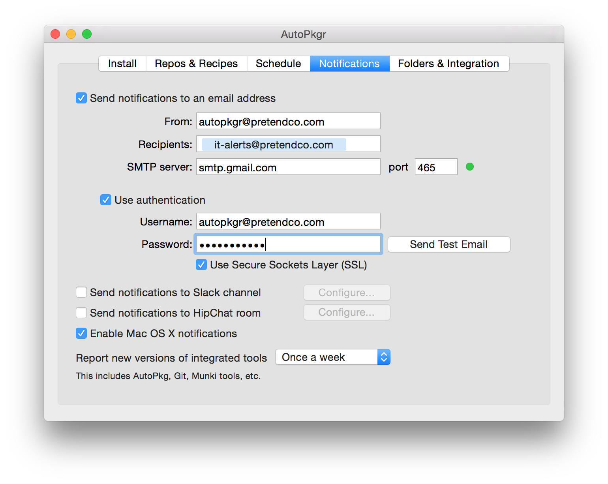

# Exercises

_[Auto Update Magic: Keeping Mac apps up to date automatically with Casper and AutoPkgr](http://www.jamfsoftware.com/news/auto-update-magic-keep-mac-apps-current-with-the-casper-suite-and-autopkgr/)_<br />_Originally presented by Elliot Jordan, Senior Consultant, [Linde Group](http://www.lindegroup.com)_<br />_JAMF Nation User Conference - October 22, 2014 - Minneapolis, MN_


## Table of Contents

<!-- #MarkdownTOC autolink=true depth=4 bracket=round -->

- [Standardized software distribution](#standardized-software-distribution)
    - [1. New Release](#1-new-release)
        - [Exercise 1: Automate checking for new software with AutoPkgr](#exercise-1-automate-checking-for-new-software-with-autopkgr)
    - [2. Development](#2-development)
        - [Exercise 2a: Install new software for local testing](#exercise-2a-install-new-software-for-local-testing)
        - [Exercise 2b: Create a deployable pkg file using AutoPkg](#exercise-2b-create-a-deployable-pkg-file-using-autopkg)
    - [3. Testing](#3-testing)
        - [Exercise 3a: Automatically create Self Service policies for testing new software](#exercise-3a-automatically-create-self-service-policies-for-testing-new-software)
    - [4. Feedback](#4-feedback)
    - [5. Deployment](#5-deployment)
        - [Exercise 5a: Promote Self Service policies to use new packages](#exercise-5a-promote-self-service-policies-to-use-new-packages)
        - [Exercise 5b: Automatically create Auto Update policies](#exercise-5b-automatically-create-auto-update-policies)
        - [Exercise 5c: Configure Macs to check for updates periodically](#exercise-5c-configure-macs-to-check-for-updates-periodically)
- [Further enhancement and advanced workflows](#further-enhancement-and-advanced-workflows)
    - [Exercise 6a: Adding More Apps](#exercise-6a-adding-more-apps)
    - [Exercise 6b: Organizing and customizing the testing recipes](#exercise-6b-organizing-and-customizing-the-testing-recipes)
    - [Exercise 6c: Sending software directly to Self Service policies](#exercise-6c-sending-software-directly-to-self-service-policies)
    - [Exercise 6d: Create installation policies for site-licensed software](#exercise-6d-create-installation-policies-for-site-licensed-software)
    - [Exercise 6e: Store your -autoupdate.jss recipes outside the search path](#exercise-6e-store-your--autoupdatejss-recipes-outside-the-search-path)

<!-- /#MarkdownTOC -->


## Standardized software distribution

Starting with a very big-picture view, consider the following illustration of the standard software distribution cycle. __This is the cycle upon which Auto Update Magic is built.__


1. New software is released by the developer.
2. The software is downloaded and basic dev testing is performed by the IT team. (i.e. "Does it install? Will it launch?")
3. The software is installed and tested on "trusted testers," which represent a fraction of the company's total Macs.
4. Feedback is collected from the trusted testers about whether the new version of the software works well.
5. Upon receiving positive feedback, the IT team makes the software available to the rest of the company, either by Self Service or automatically.

This process may vary slightly depending on the software you're deploying and your organizational needs, but you'll find that most software deployments follow this path.

We will be automating some of these steps, but not all. To adapt a popular mantra:


Let's walk through each step in the above process using Firefox as an example and focus on how we can automate and standardize things to make our lives easier, shall we?

### 1. New Release


Let's start from the beginning. It's no fun to manually check for new software. Instead, the combination of [AutoPkgr](https://github.com/lindegroup/autopkgr) and [AutoPkg](https://github.com/autopkg/autopkg) can do this for you. You can configure new software checks to happen on a scheduled basis, and you can even receive notifications when new software is found.

<a name="e1"></a>

#### Exercise 1: Automate checking for new software with AutoPkgr

1. Download the [latest release of AutoPkgr](https://github.com/lindegroup/autopkgr/releases/latest).

2. Copy the app to your __Applications__ folder, then launch it from there.

3. If AutoPkg is not already installed, click the __Install AutoPkg__ button and enter your password when prompted.

4. If Git is not already installed, click the __Install Git__ button and enter your password when prompted.

5. On the __Repos & Recipes__ tab, check the box to add the topmost repository, `https://github.com/autopkg/recipes.git`.

6. In the list of recipes at the bottom of the window, check the box to add __Firefox.download__. (You can use the "Filter recipes" box to narrow down the list.)
    

7. Switch to the __Schedule__ tab, and configure the schedule to run as desired. Check the __Enable scheduled AutoPkg runs__ box.

    

8. Switch to the __Notifications__ tab, and configure the notifications as desired.

    

9. Switch back to the __Repos & Recipes__ tab, and click __Run Recipes Now__. After a minute or so, assuming you haven't run this recipe before, you should receive notification that a new version of Firefox is available.

Congratulations! You've just configured AutoPkgr to check for updates regularly, and to tell you when a new version is released. For Firefox in your organization, Phase 1 of the software distribution cycle is now fully automated. Let's move on to Phase 2.

### 2. Development


Now that we know there's a new release, we've got to make sure it passes some basic "lemon tests." There's a type of recipe called an install recipe that will actually install the app on the Mac running AutoPkg. Let's schedule that recipe to run regularly, so that our IT lab test Mac is always up to date for local testing.

<a name="e2a"></a>

#### Exercise 2a: Install new software for local testing

1. Open AutoPkgr and navigate to the Repos & Recipes tab.

2. Uncheck the __Firefox.download__ recipe, and check the __Firefox.install__ recipe instead.

    

3. Click __Run Recipes Now__.

4. After a minute, you should receive notification that Firefox was installed. Check the Applications folder on your AutoPkgr Mac and verify that this is true.

5. Does it launch? Open Firefox and see. Does it work as expected? Browse to a few websites.

Great! You've just configured AutoPkgr to automatically update Firefox on your AutoPkgr Mac. This makes it easy for you to test apps to make sure there are no major flaws before you dive in further.

Next, we need to prepare the software for mass distribution, which often includes creating a package that can be used by Jamf Pro. Of course, this is what AutoPkg was born to do! Let's run the __Firefox.pkg__ recipe, and see the nice tidy pkg file that results:

<a name="e2b"></a>

#### Exercise 2b: Create a deployable pkg file using AutoPkg

1. Open AutoPkgr and navigate to the __Repos & Recipes__ tab.

2. Check the box to enable the __Firefox.pkg__ recipe.

3. Click __Run Recipes Now__. After a minute, you should receive notification that a new Firefox package was built.

4. Switch to the __Folders & Integration__ tab, then click the __Open in Finder__ button next for the AutoPkg Cache folder. Open the __com.github.autopkg.pkg.Firefox_EN__ folder. (Note: This matches the identifier of the recipe, which you can see in AutoPkgr's recipe list.)

5. Verify that a Firefox package was created. You may also want to use a tool like [Pacifist](https://www.charlessoft.com/) or [Suspicious Package](http://www.mothersruin.com/software/SuspiciousPackage/) to inspect its contents. As you can see below, the app installs at the expected location, and with the expected version. Looks good.

    

6. Copy the package to a test Mac or VM and try installing it. Verify that it produces a working copy of Firefox.

    It may also be worth launching the app as a non-admin user after installing the package in your test Mac or VM. Occasionally this will reveal permissions issues that need to be corrected upstream (e.g. in the pkg recipe).

Great, now we have a deployable package that installs what we expect it to install. Now we're ready to start testing the app on a larger scale.

### 3. Testing


Small batch testing (or "staging") allows us to catch _small_ problems in the wild before they become _large_ problems in the wild.

In order to do proper testing, I recommend that you reach out to your organization and designate/ask for volunteers to help the IT department test new software. They should understand that they'll have first access to new features and the ability to help guide deployment strategy, but they will also have the responsibility to submit feedback to IT in a timely manner.

Once you've got a group of "trusted testers," we can use JSSImporter to automate the process of sending them new software. Specifically, we'll create Self Service policies for testers that are automatically updated whenever new software is released. This is the default behavior for recipes in the official [jss-recipes](https://github.com/autopkg/jss-recipes#jss-recipes) repo, and is a good, safe way to get started integrating AutoPkg with Jamf Pro.

<a name="e3a"></a>

#### Exercise 3a: Automatically create Self Service policies for testing new software

1. Create a (static or smart) computer group on your JSS called __Testing__. Add the testers' computers to the group.

2. Create an account on your JSS with __Create__, __Read__, and __Update__ access to the following objects:
    - Categories
    - Computer Extension Attributes
    - File Share Distribution Points (only needs Read access)
    - Packages
    - Policies
    - Scripts
    - Smart Computer Groups
    - Static Computer Groups

3. Open AutoPkgr and click on the __Folders & Integration__ tab, then click __Install JSSImporter__. Enter your admin password when prompted.

    ⚠️ Note: On Macs with a fresh copy of Sierra, you may additionally need to run the following Terminal command to install the necessary components for JSSImporter:

    ```
    sudo easy_install pip && pip install -I --user pyopenssl
    ```

4. Click the button that now says __Configure JSSImporter__.

5. Enter the JSS URL, API username, and API password (for the account you created in step 2 above). Then click __Connect__.

    

6. If you use file share distribution points, you'll be prompted to enter their passwords. If you use a cloud distribution point or JDS as your master, check the __Use Master JDS__ checkbox. Click __Save and Close__.

7. Return to the __Recipe & Repos__ tab, and find (but don't check the box for) __Firefox.jss__ in the recipe list.

8. Right-click on __Firefox.jss__ and choose __Create Override__.

9. Name the override __Firefox-testing.jss__.

10. The new recipe should appear in AutoPkgr's recipe list. Right-click on __Firefox-testing.jss__ and choose __Set Recipe Editor__. Select your preferred text editor. (If you don't have one, I suggest [TextWrangler](http://www.barebones.com/products/textwrangler/) to get you started. Don't use TextEdit, Pages, or Word.)

11. Right-click on __Firefox-testing.jss__ again, and choose __Open Recipe Override__.

    Does this look familiar? If you've seen Apple preference files before, you'll recognize this as a plist (property list) file.

12. Change the CATEGORY to __Web Browsers__, but leave the POLICY_CATEGORY and everything else as-is. The CATEGORY key/value pair will look like this:

    ```
    <key>CATEGORY</key>
    <string>Web Browsers</string>
    ```

    This is just an example; you can change the category to whatever you want. The point I'm illustrating is that a recipe "override" allows you to override specific keys in pre-fabricated recipes. Overrides also allow you to name your recipes in a consistent manner, as with the __-testing__ suffix we're using here. This makes it easier to find in the AutoPkgr recipe list later.

13. Save, then quit your text editor. I have provided an example __Firefox-testing.jss.recipe__ file in the [Exercise3a](exercises/Exercise3a) folder in this repo. Compare your finished override to that file to make sure it looks the same.

    If so, congratulations! You just created a recipe override.

    ⚠️ Note: Now we're ready to run our __Firefox-testing.jss__ recipe override. Although you could easily run this recipe in AutoPkgr, I want you to use the Terminal for two reasons:

    - It's important to know what's happening behind the scenes.
    - Knowing basic `autopkg` commands in Terminal will make things much easier to troubleshoot later.

14. Open Terminal, type `autopkg run -v Firefox-testing.jss` and press Enter. Observe the messages that appear on screen. The first word of each line indicates which "processor" AutoPkg is currently running.

If everything goes according to plan, you'll see the following processors make an appearance: MozillaURLProvider, URLDownloader, EndOfCheckPhase, AppDmgVersioner, PkgRootCreator, Copier, PkgCreator, and JSSImporter.

The output in Terminal will also reflect the changes made to your JSS:

```
The following changes were made to the JSS:
Package             Categories  Groups                Scripts  Extension Attributes  Policy                  Icon
-------             ----------  ------                -------  --------------------  ------                  ----
Firefox-40.0.3.pkg              Firefox-update-smart                                 Install Latest Firefox  Firefox.png
```

If any errors occur, read through the last few lines of output (including any "traceback" messages), and you may be able to tell what went wrong.

It's not uncommon for a 404 error to occur the first time you run each recipe, because Jamf Pro's API doesn't reliably handle uploading icons for Self Service policies. If this happens, try running the recipe again a second time.

Once your `autopkg` run is error-free, navigate to your JSS web app and log in. You should see the following new items:

- A package with the latest version of Firefox.
- A smart group called "Firefox-update-smart" that contains Macs in the Testing group which don't have the latest version of Firefox.
- A policy called "Install Latest Firefox" that allows your testers to install Firefox via Self Service.


Once the Self Service policy is created in Jamf Pro, you should email your testers to let them know there's new software to install. Ask them to install the app, kick the tires thoroughly, and let you know within a specific time whether they have anything to report.

Finally, be sure to return to AutoPkgr and check the box to enable the __Firefox-testing.jss__ recipe and uncheck the __Firefox.pkg__ recipe.

### 4. Feedback


It's important not to skip this step! Collecting feedback from your testers ensures that you'll have the best chance possible of finding show-stopping bugs before you deploy the software to the rest of your company. It also makes people within your company more aware of an important IT process.

The process of collecting feedback from your testers can be made easier by creating a Self Service plugin that points to a Google Form. I won't provide specific instructions for doing that, because you and I both know that this article is already going to be way too long.

Once you've collected feedback, your IT department will need to make a decision about whether to proceed with deployment or hold back. In case you need to hold back, I've provided a [Rollback Plan](#rollback-plan) below.

### 5. Deployment


Here comes the really fun part! Once you've decided to proceed with deployment, you'll probably want to consider two deployment methods, depending on the specific software and how important it is to your organization.

- __Self Service policy__ for delivering the newly tested and approved version of Firefox to your company Macs on an opt-in basis. The Self Service policies are easy to set up and maintain, and we'll do that in [Exercise 5a](#e5a).

- __Auto Update policy__ for silently updating Firefox on all the Macs that have an outdated version of it. The Auto Update policies are admittedly complex to set up, but are relatively painless to maintain after that. We'll tackle that in [Exercise 5b](#e5b).

__Historical note:__ The [previous version](https://github.com/homebysix/auto-update-magic/tree/v1.0) of this workflow used a Jamf Pro "trigger" policy instead of a local LaunchDaemon. There are some pros and cons to the two different approaches:

|     &nbsp;      | Script runs in Jamf Pro policy                                                  | Script runs via local LaunchDaemon                                                                       |
| :-------------: | :---------------------------------------------------------------------------- | :------------------------------------------------------------------------------------------------------- |
| __Pros__<br />👍 | - Easy to update the script centrally.                                        | - Much cleaner log output.<br />- More granular adjustment of checking schedule.                         |
| __Cons__<br />👎 | - The Jamf Pro policy logs fill with output, even if no updates were installed. | - Must repackage and reinstall LaunchDaemon/script pair when making changes to schedule or updated apps. |

I now prefer the LaunchDaemon method, which is detailed in [Exercise 5b](#e5b) below. If you prefer the old Jamf Pro policy method, [version 1.0 of this document still contains those instructions](https://github.com/homebysix/auto-update-magic/tree/v1.0#level-3-auto-to-all).

⚠️ Note: The following script, recipe, and template customizations require an administrator (that's you!) who is comfortable with editing plist files and shell scripts. Also, be sure to proceed with a sleeves-rolled-up attitude, since troubleshooting and tweaking will more than likely be necessary. Be sure you test these methods on a non-production JSS before making changes to your production environment.

<a name="e5a"></a>

#### Exercise 5a: Promote Self Service policies to use new packages

1. If you don't already have one, manually create a Self Service policy on the JSS that installs Firefox for anybody who wants it. Here's an example:
    - __General__
        - Name: Firefox
        - Category: Productivity
        - Enabled: Yes
        - Trigger: None
        - Execution Frequency: Ongoing
    - __Packages__
        - Firefox-39.0.5.pkg
            (or any old version of Firefox, as long as the package name is in the format "Firefox-x.x.x.pkg")
    - __Scope__
        - Targets: All Computers
    - __Self Service__
        - Make this policy available in Self Service: Yes
        - Description: Popular web browser.
        - Icon: Upload a 128x128 Firefox icon in png format.

2. Install the jss_helper command line tool. You can do that with the following command in Terminal. (Substitute `~/Developer` for the directory you'd like to store jss_helper in. Create the directory first, if needed.)

    ```
    cd ~/Developer
    /usr/local/git/bin/git clone https://github.com/sheagcraig/jss_helper
    ```

    (Using Git to install jss_helper makes it trivial to keep the tool up to date as new versions are released, using `git pull -C ~/Developer/jss_helper`. You may want to make a note to run this command every so often.)

3. Run the following commands to copy your JSS credentials into the jss_helper configuration plist:

    ```
    defaults write com.github.sheagcraig.python-jss jss_url "$(defaults read com.github.autopkg JSS_URL)"
    defaults write com.github.sheagcraig.python-jss jss_user "$(defaults read com.github.autopkg API_USERNAME)"
    defaults write com.github.sheagcraig.python-jss jss_pass "$(defaults read com.github.autopkg API_PASSWORD)"
    ```

    ⚠️ Note: If you have characters or symbols in your password, you may want to use a text editor to verify that the ~/Library/Preferences/com.github.sheagcraig.python-jss.plist file contains the correct password after you run the above commands. Certain characters don't parse as expected in Terminal and may require you to enter them directly into the plist.

4. Now, use jss_helper to "promote" your Self Service policy to the latest version of Firefox:

    ```
    cd ~/Developer/jss_helper
    ./jss_helper promote
    ```

    ⚠️ Note: If your JSS uses a self-signed certificate, you'll get errors that say `InsecureRequestWarning: Unverified HTTPS request is being made.` This is normal, but you should really invest in a proper SSL cert if this is your production JSS.

5. All the policies for which there is a newer package available will be listed. Type the number corresponding to your "Firefox" policy.

6. Confirm that the `(CURRENT)` package is your previously-approved package, and the `(DEFAULT)` package is the one you just finished testing and is now approved. If so, press __Enter__. (To cancel, press Control-C.)

Cool! Your Self Service policy has just been updated to use the new Firefox package.

<a name="e5b"></a>

#### Exercise 5b: Automatically create Auto Update policies

Now strap yourselves in and get ready. We're going to enter the wormhole... Installing newly tested and approved updates on all managed Macs using some "Auto Update Magic." Here's what we'll be configuring in order to make that happen:

- __Recipe override and JSSImporter templates__ - A set of AutoPkg recipe overrides will be run _manually_ in order to create/update policies that automatically update Firefox on all managed Macs when a custom trigger is called.

- __Script__ - The auto_update_magic.sh script on all managed Macs checks to see whether Firefox is running, and if not, it uses the custom trigger to execute the "auto update Firefox" policy.

- __LaunchDaemon__ - A LaunchDaemon on all managed Macs runs the auto_update_magic.sh script on a regular basis.

Now you can start to see how this is all going to fit together. The LaunchDaemon basically serves as a recurring "do I need updates?" check, the script makes sure the installation won't stomp on any running apps, and the policy (created by our recipe override) actually does the work of updating.

Here we go! Let's start with the recipe override and JSSImporter templates:

1. Copy the provided __Firefox-autoupdate.jss__, __PolicyTemplate-autoupdate.xml__, and __SmartGroupTemplate-autoupdate.xml__ files from the [Exercise5b](exercises/Exercise5b) folder of this repo into your `~/Library/AutoPkg/RecipeOverrides` folder.

    Here is how the files differ from the standard recipes and templates included in jss-recipes:

    - __Firefox-autoupdate.jss__ has the policy category set to "Auto Update," so that all the policies created by __-autoupdate.jss__ recipes will be listed together in the Policies page on the JSS.
    - __PolicyTemplate-autoupdate.xml__ uses "Auto Update Firefox" as the policy name, the policy frequency is set to Ongoing, and the policy is triggered by a custom trigger "autoupdate-Firefox". (The reason for this will become clear in [Exercise 5b](#e5b.)
    - __SmartGroupTemplate-autoupdate.xml__ includes computers from the entire organization which have an obsolete version of Firefox, rather than being limited to the Testing group only.

2. Open Terminal and run your __Firefox-autoupdate.jss__ recipe override:

    ```
    autopkg run -v Firefox-autoupdate.jss
    ```

3. After a moment, you should see the summary of changes made to your JSS. Log in to your JSS and check out the newly created items:

    - A __smart group__ called "Firefox-autoupdate" that includes all Macs with old versions of Firefox.
    - A __policy__ called "Auto Update Firefox" that installs Firefox on Macs in the above smart group, but only when the "autoupdate-Firefox" custom trigger is used.

    You can test this policy by running `sudo jamf policy -event "autoupdate-Firefox"` on a test Mac, if you like.

<a name="e5c"></a>

#### Exercise 5c: Configure Macs to check for updates periodically

1. Open the [Exercise5c](exercises/Exercise5c) folder.

2. Edit the __auto_update_magic.sh__ script with a text editor. Make the following three changes:
    - Un-comment line 26, where Firefox's recipe name is specified.
    - Un-comment line 46, where Firefox's blocking applications are specified.

3. Open Terminal and run the script (since `DEBUG_MODE` is on by default, nothing will actually be updated):

    ```
    cd ~/Downloads/auto-update-magic-master/Exercise5c/
    sudo ./auto_update_magic.sh
    ```

4. You should see the script check whether Firefox is running. If Firefox isn't running, it will say `No apps are blocking the Firefox update.`

    If the script doesn't behave as described above, stop here and troubleshoot before proceeding.

5. Open the __auto_update_magic.sh__ script in a text editor again, and change `DEBUG_MODE` to `false` on line 65. The script is now ready to deploy.

    ⚠️ Note: Keep in mind that you'll need to edit this script again if you add more "auto updated" apps in the future. You'll find instructions for doing that in the <a href="#adding-more-apps">Adding More Apps</a> section.

6. Edit the __com.jamfsoftware.jamfnation.auto_update_magic.plist__ file with a text editor. Set the `StartInterval` as desired. (Default is 3600, which is one hour.)

7. Create a package that you can use to deploy the script and LaunchDaemon. With [munkipkg](https://www.munki.org/munki-pkg/) installed, run this command to generate a new installer package in the build folder:

    ```
    munkipkg /path/to/auto_update_magic
    ```

    Once the package is created, upload it to your Jamf Pro server using Jamf Admin or the Jamf Pro web interface.

8. Create a policy on Jamf Pro that will deploy the Auto Update Magic script and LaunchDaemon to all managed computers. Here's an example:

    - __General__
        - Name: Auto Update Magic
        - Category: Auto Update
        - Enabled: Yes
        - Trigger: Recurring check-in
        - Execution Frequency: Once per week
    - __Packages__
        - auto_update_magic-YYYYMMDD.pkg
            (the one you generated in the previous step)
    - __Scope__
        - Targets: All Computers

9. Monitor the logs to ensure that the package is successfully installed on your org's Macs. Soon after their next check-in, they should automatically update Firefox if it isn't running. Hip hip hooray!

## Further enhancement and advanced workflows

There are some additional things you can consider doing, if they fit well with your organization's needs.

<a name="e6a"></a>

#### Exercise 6a: Adding More Apps

Once you're confident the Firefox recipes are working well, you'll most likely want to add more apps to the Auto Update Magic workflow.

If a [jss recipe](https://github.com/autopkg/jss-recipes) already exists for the app you want to add, this process is super simple.

1. Create a __-testing.jss__ recipe override. Use the existing __Firefox-testing.jss__ recipe override as a template for this.

2. Create a __-autoupdate.jss__ recipe override. Use the existing __Firefox-autoupdate.jss__ recipe override as a template for this.

    In most cases, simply changing the recipe Identifier and ParentIdentifier are sufficient, but more complex apps may require a custom smart group template or extension attribute template.

    I've included some examples in the [Exercise6a](exercises/Exercise6a) folder for Flash, Chrome, and Java.

3. Modify the __auto_update_magic.sh__ script to include the trigger and blocking applications. Make sure that the list of triggers and list of blocking applications are in the same relative order.

4. Use [munkipkg](https://www.munki.org/munki-pkg/) to create a new script/LaunchDaemon package for deployment, as you did in [Exercise 5c](#e5c).

5. Swap the new package into the __Auto Update Magic__ policy. If you need it to be deployed immediately, flush the __Auto Update Magic__ policy logs.

<a name="e6b"></a>

#### Exercise 6b: Organizing and customizing the testing recipes

Once you get more familiar with the relationship between recipe overrides and JSSImporter templates, I'd recommend returning to the __-testing.jss__ recipes you created in [Exercise 3a](#e3a) and making some subtle changes:

- Creation of a policy template called __PolicyTemplate-testing.xml__ with these customizations:
    - Policy name is "Test Latest %PROD_NAME%"
        This makes it clear to your trusted testers that this is a test policy, as opposed to a normal Self Service policy.
    - Policy has a custom trigger called "test-%PROD_NAME%"
        This makes it really easy to differentiate policies that are created by AutoPkg from policies that you created manually, when viewing the Policies page on the JSS.
    - Policy scope is set to a specific group, using the group's `id` and `name`.
        This means that you only need a single "Testing" group, rather than separate AppName-testing smart groups for each app. Greatly reduces smart group bloat.
- Adjusting the `POLICY_TEMPLATE` key in each -testing.jss recipe to point to the new __PolicyTemplate-testing.xml__ file you created.
- Removing keys from the __-testing.jss__ overrides that are not different than the parent recipe. (Only those keys that are different are necessary to include in overrides.)

I have provided an example __PolicyTemplate-testing.xml__ file as well as modified __-testing.jss__ recipes in the [Exercise6b](exercises/Exercise6b) folder in this repo.

<a name="e6c"></a>

#### Exercise 6c: Sending software directly to Self Service policies

⚠️ This is the workflow that's most likely to bite you later, because it's deploying directly to production. Proceed with caution.

For certain software, you may want to have updates available immediately in Self Service. This workflow is good for software which meets the following criteria:

- The software is not mission-critical for your organization.
- You do not want to test the software prior to making it available in Self Service, and you understand the risks this introduces.

I have included a policy template and two recipes that you can use as an example for this, in the [Exercise6c](exercises/Exercise6c) folder. They all contain `-selfservice`.

<a name="e6d"></a>

#### Exercise 6d: Create installation policies for site-licensed software

If you have a site license for software you'd like to automatically update, you might wonder what the best way to deploy both the app and the license. Here's what I've done:

- AutoPkg recipes create a policy that installs the latest version of the app, just like the __-autoupdate.jss__ recipes we created earlier. However, this policy also calls a custom trigger "license-AppName."
- A manually created policy installs the license, and is only triggered by the "license-AppName" trigger.

In the [Exercise6d](exercises/Exercise6d) folder of this repo, I have included an example of an __-selfservice.jss__ recipe override and policy template for 1Password which illustrates this method.

<a name="e6e"></a>

#### Exercise 6e: Store your -autoupdate.jss recipes outside the search path

For added safety, store your __-autoupdate.jss__ recipes outside of the AutoPkg search path. For example, you could create new folder at ~/Library/AutoPkg/AutoUpdateRecipes and keep them inside. Then when you run the recipe in Terminal, you'll need to refer to the full path, like this:

```
autopkg run -v "~/Library/AutoPkg/AutoUpdateRecipes/Firefox-autoupdate.jss.recipe"
```

The benefit of this adjustment is that the __-autoupdate.jss__ recipes won't appear in AutoPkgr, and are therefore less likely to be executed accidentally or incorrectly included in scheduled AutoPkg runs.
